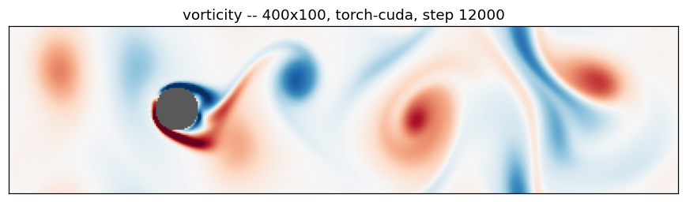

# FluidBench

A fluid simulation benchmark for comparing CPU and GPU performance using the same
computational workload.

The workload is a D2Q9 lattice Boltzmann simulation of flow past a cylinder — the
classic von Kármán vortex street. It is a good benchmark kernel because it is
memory bound, purely elementwise plus nine circular shifts, and has no
data-dependent branching. The solver is written **once**, against a small backend
interface, so numpy, CuPy and PyTorch all execute the same sequence of operations
on bit-identical starting data. `validate` proves it rather than asserting it.



## Quickstart

```bash
pip install -r requirements.txt

python main.py list                    # what this machine can run
python main.py bench                   # time every backend at 400x100
python main.py sweep                   # find where the GPU takes over
python main.py validate                # check the backends agree
python main.py sim --save vortex.gif   # render the flow
python main.py serve                   # interactive flow viewer in a browser
```

The CPU backend needs only numpy. For a GPU, install either a CUDA build of
PyTorch or CuPy — FluidBench detects whichever is present and ignores the rest.

## Results

Measured on an RTX 2070 (8 GB) against an Intel i7-10750H, float32, best of 2:

| grid | cells | numpy | torch-cpu | torch-cuda | GPU speedup |
|---|---:|---:|---:|---:|---:|
| 200×50 | 10 k | 5.3 MLUPS | 3.0 | 4.6 | **0.85×** |
| 400×100 | 40 k | 2.9 | 6.6 | 17.2 | 5.8× |
| 800×200 | 160 k | 3.3 | 7.2 | 74.1 | 22.7× |
| 1600×400 | 640 k | 3.0 | 5.7 | 89.7 | 30.4× |
| 3200×800 | 2.6 M | 2.8 | 5.3 | 89.6 | **32.3×** |

MLUPS is million lattice updates per second, the standard LBM metric:
`nx · ny · steps / seconds`.

The interesting part is the top row. **At 200×50 the GPU loses to a single numpy
core**, and at 400×100 its absolute throughput is no better than at 800×200 with
four times the work. That is not the GPU being slow; it is the grid being too
small to keep it busy. Each step issues roughly 60 kernels, and below about a
million cells the GPU drains that queue faster than Python can fill it. The
benchmark measures this directly — it times the step loop with and without
synchronizing — and labels such rows `launch-bound`:

```
backend        grid    dtype  steps  best(s)  ms/step  MLUPS  GB/s  speedup          note
torch-cuda  400x100  float32    150   0.2789    1.860   21.5   1.5    5.73x  launch-bound
```

Two things follow, and they are the practical lesson of the whole exercise:

- **A GPU speedup quoted at one problem size means very little.** Sweep the size.
- Once past the crossover the GPU saturates at ~90 MLUPS and the ratio stops
  growing, because both sides are now bandwidth bound rather than latency bound.

### A caveat on the GB/s column

It is computed from a minimum-traffic model — streaming must read and write all
nine populations per cell per step, so `2 · 9 · sizeof(dtype)` bytes. Real traffic
is higher, because this implementation materialises the equilibrium and other
full-size temporaries instead of fusing the step into one pass. Treat the column
as a lower bound and a relative indicator, not as a roofline measurement. A fused,
hand-written CUDA kernel would land several times higher.

## Commands

| command | what it does |
|---|---|
| `list` | which backends are installed, and the device each would use |
| `bench` | time every backend at one grid size |
| `sweep` | the same across a range of sizes, and report the crossover |
| `validate` | run each backend against a reference and report the drift |
| `sim` | run and visualise, to a window or a `.gif` / `.mp4` |
| `serve` | an interactive, full-screen flow viewer in the browser |

Useful flags: `--size 800x200`, `--sizes 200x50,400x100,...`, `--dtype float64`,
`--steps`, `--warmup`, `--repeats`, `--backends numpy torch-cuda`, `--threads`,
`--json out.json`, `--csv out.csv`. `--backends` also accepts `cpu`, `gpu` and
`all`.

### Validating that it really is the same workload

```
$ python main.py validate --dtype float64 --tolerance 1e-9

backend     max |drho|  max rel drho   max |du|    tol
torch-cuda   3.268e-13     2.951e-15  1.669e-15  1e-09  pass
torch-cpu    3.411e-13     3.079e-15  1.388e-15  1e-09  pass
```

Bit-identical agreement is not on offer: floating-point addition is not
associative and a GPU sums reductions in a different order. What matters is that
the gap stays at rounding level — 3×10⁻¹⁵ relative after 100 steps — rather than
growing into different physics. Run this in float64; in float32 the rounding
floor is around 10⁻⁷ and a tight tolerance is meaningless.

## The viewer

```bash
python main.py serve            # http://localhost:8000
```

A full-screen, real-time D2Q9 simulation of flow past a cylinder, running on
your GPU in WebGL2. Adjust viscosity, inflow velocity and obstacle size live,
switch between vorticity and speed fields, and drag the cylinder to move it.
Shortcuts: `Space` play/pause, `.` step, `R` restart, `H` hide the interface,
`F` fullscreen, `1`–`4` switch the field.

The viewer is a separate WebGL implementation of the same scheme, not the
Python kernel the CLI benchmarks, so it doesn't report benchmark numbers. It
adds **no dependencies**: the server is stdlib `http.server`, and the page has
no build step and no CDN tags.

Useful flags: `--port`, `--no-browser`, `--verbose`. `--host 0.0.0.0` exposes it
to your network, which lets anything on that network start runs on this machine —
it is bound to localhost by default for that reason.

### How the viewer differs from the solver

The viewer is a **separate WebGL
implementation** of the same D2Q9 scheme, in `fluidbench/web/lbm-gl.js`. It is
not the kernel the benchmark times. It follows the same step order and the same equilibrium, so the physics is the
same, but it differs deliberately in two ways: it drives the flow with an inlet
strip so the wake does not decay over an afternoon (the toggle turns that off,
and you can watch it die the way the unforced Python solver does), and it uses a
slimmer cylinder set further upstream, because a 16:9 window has nowhere near
the eleven diameters of wake that the 4:1 reference case leaves downstream.

It needs WebGL2 with `EXT_color_buffer_float`. Half precision is not an option:
rho is around 100 and a step moves a population by ~1e-4, far below a 10-bit
mantissa. Without it the page shows a message explaining what is missing.

## Benchmarking notes

Three things make the numbers trustworthy, and all three are easy to get wrong:

- **Warm up.** The first GPU steps pay for context creation, kernel loading and
  allocator growth, and the clocks have not ramped yet. `--warmup` steps run
  untimed.
- **Synchronize before stopping the clock.** CUDA calls are asynchronous, so a
  naive timer measures how fast Python can *queue* work, not how fast the GPU
  finishes it. Skipping this is how benchmarks "prove" 1000× speedups.
- **Start from identical data.** The initial condition is generated once on the
  host from a seeded generator and copied to each device, so no backend gets an
  easier problem.

float32 is the default because consumer GPUs run float64 at a fraction of the
rate — a GeForce card is 1/32. Benchmarking in float64 measures that penalty, not
the architecture; use `--dtype float64` deliberately, and for `validate`.

`numpy` is the speedup baseline. It is single-threaded for elementwise work,
which is why `torch-cpu` — same CPU, multithreaded kernels — shows about 2×. That
row is there to separate "the GPU is fast" from "numpy is single-threaded".

## Two bugs worth knowing about

Both are easy to hit when writing this kind of solver, and both are fixed here.

**Initialise at equilibrium.** The widely-copied tutorial version seeds the
populations as `F = ones + noise`, which is far from any equilibrium state. The
collision term over-relaxes — ω = 1/τ ≈ 1.89, close to the stability limit of 2 —
so the very first step overshoots into *negative* populations, and the run blows
up at the cylinder within about 60 steps. The fix is to start at the local
equilibrium for the intended density and velocity, which is a fixed point of the
collision operator. Populations then stay strictly positive and the run is stable
indefinitely. `test_populations_stay_positive` guards this.

**Don't index with a boolean mask in a GPU hot loop.** Bounce-back off the
cylinder naturally reads `f[obstacle]`. Masked indexing has to count the selected
elements before it can size its output, which on CUDA means a device-to-host
synchronization *on every step* — it serialises the pipeline and throws away the
overlap between host and device. Precomputing the obstacle cell indices once on
the host and indexing with those was worth 1.4× on its own.

## The simulation

D2Q9 lattice Boltzmann with a single-relaxation-time (BGK) collision. Each step:

1. **Stream** — every population hops one cell along its lattice direction.
2. **Capture** the populations that streamed into the cylinder, reversed.
3. **Reduce** to density and velocity.
4. **Collide** — relax toward the local equilibrium by ω = 1/τ.
5. **Bounce back** — write the reversed populations back, giving a no-slip wall.

Defaults: 400×100, τ = 0.53 (ν = 0.01), free-stream velocity 0.1 in lattice units
(Mach 0.17), cylinder diameter 13% of the height. That is Re ≈ 260 — well past the
shedding threshold of Re ≈ 47. The wake starts oscillating after a few thousand
steps and sheds discrete vortices by around 10,000, which is why `sim` defaults
there.

Both directions are periodic and there is no forcing, so the cylinder's drag
slowly removes momentum: the mean velocity decays roughly 15% over 3,000 steps and
50% over 16,000. The vortex street is fully developed well before that matters,
but for a physically sustained flow you would add a body force or a proper inlet
boundary. The configuration is validated for stability at the default size;
`sweep` scales the grid while holding τ and velocity fixed, so the effective
Reynolds number rises with it. Timings stay valid either way — the arithmetic is
identical — and any run that does diverge is flagged `diverged` rather than
quietly reported.

## Layout

```
main.py                  entry point
fluidbench/
  backends.py            numpy / cupy / torch, behind one small interface
  lbm.py                 the solver — backend-agnostic
  benchmark.py           timing harness, metrics, cross-backend comparison
  visualize.py           vorticity rendering (never timed)
  cli.py                 argument parsing and output
  server.py              the viewer's HTTP layer (stdlib only)
  web/                   the flow viewer: no build step, no CDN
    index.html           page
    style.css            glass over the flow; one place the palette lives
    app.js               config, job streaming, result rendering
    charts.js            small SVG chart layer
    lbm-gl.js            the WebGL flow -- NOT the benchmarked kernel
tests/test_lbm.py        33 tests: physics, backends, harness
```

## Tests

```bash
python -m pytest tests -v
```

Covers lattice-constant identities (the weights must reproduce the correct second
moment, and reversed directions must actually reverse), mass conservation,
stability and positivity of the reference case, determinism under a fixed seed,
and the harness itself. The backend tests are parametrised over whatever is
installed, so the GPU is checked against numpy automatically when present.

## Adding a backend

Implement four methods — `asarray`, `to_numpy`, `roll`, `synchronize` — and
register the class in `_REGISTRY` in `backends.py`. The solver needs nothing else;
everything else it does is broadcast arithmetic, reductions and indexing, which
numpy, CuPy and torch spell identically.

A hand-written CUDA kernel is the natural next backend and would be the honest
upper bound for this problem: fusing stream-collide-bounce into a single kernel
removes both the ~60 launches per step and all the temporaries, which is most of
what the numbers above are losing to. The registry is the place to hang it.

## Licence

MIT — see [LICENSE](LICENSE).
